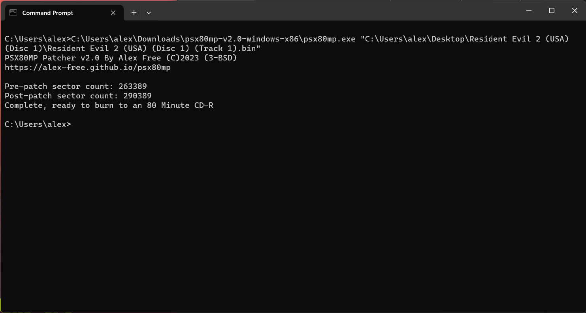
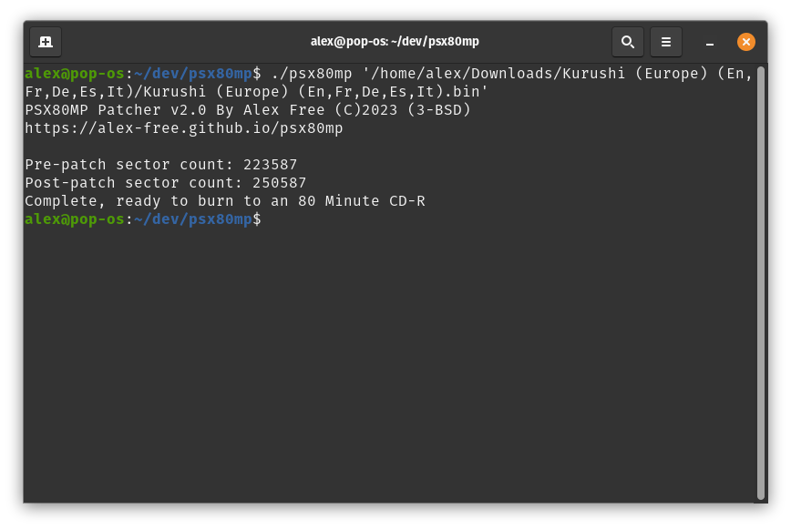

# [alex-free.github.io](https://alex-free.github.io)

# PSX 80 Minute Patcher

_By Alex Free_

The earliest PS2 console models (SCPH-10000-SCPH-39004) have an [issue](https://github.com/socram8888/tonyhax/issues/24) handling large seek distances with an 80 minute CD-R. This issue causes a [number of games](#boot-test-list) to not boot if burned to an 80 minute CD-R. It is applicable to mod-chipped PS2s using the normal boot process, as well as most homebrew loaders.

New old stock 74 minute and 71 minute CD-Rs [work correctly](https://github.com/socram8888/tonyhax/issues/24#issuecomment-1364089965). This issue is only present with 80 minute CD-Rs, which are unfortunately the lowest capacity still made brand new as of 2023. The solution for 80 minute CD-Rs is to use this patcher first before burning, which overcomes the issues encountered with 80 minute CD-Rs, allowing them to work just as well as lower capacity CD-Rs for the affected PS2 console models. Any burning software can be used with the patched disc image. Note that [IMGBurn](https://www.imgburn.com/) disc verification will fail for the patched disc image, that is ok and expected.

**[Tonyhax International](https://alex-free.github.io/tonyhax-international) as of the v1.4.5 update now includes a workaround for booting the affected games when burned to an 80 minute CD-R, so no patching is required anymore**. This patcher _may_ still help the affected PS2 consoles to read PSX games burned to 80 minute CD-R better while in-game, after boot. That is something Tonyhax International has no control of. This is because some games may also do large seeks in-game, potentially the same issue. This has not been seen plainly yet however...

| [Homepage](https://alex-free.github.io/psx80mp) | [Github](https://github.com/alex-free/psx80mp) |

## Table Of Contents

*   [Downloads](#downloads)
*   [Usage](#usage)
*   [Boot Test List](#boot-test-list)
*   [License](#license)
*   [Building](build.md)

## Downloads

### Version 2.0 (11/26/2023)

*	[psx80mp-v2.0-windows-x86](https://github.com/alex-free/psx80mp/releases/download/v2.0/psx80mp-v2.0-windows-x86.zip) _For Windows 95 OSR 2.5 Or Newer (32-bit Windows)_
*	[psx80mp-v2.0-windows-x86\_64](https://github.com/alex-free/psx80mp/releases/download/v2.0/psx80mp-v2.0-windows-x86_64.zip) _For 64-bit Windows_
*	[psx80mp-v2.0-linux-x86](https://github.com/alex-free/psx80mp/releases/download/v2.0/psx80mp-v2.0-linux-x86_static.zip) _For x86 Linux Distros_
*	[psx80mp-v2.0-linux-x86\_64](https://github.com/alex-free/psx80mp/releases/download/v2.0/psx80mp-v2.0-linux-x86_64_static.zip) _For x86_64 Linux Distros_
*	[psx80mp-v2.0-source](https://github.com/alex-free/psx80mp/archive/refs/tags/v2.0.zip)

## Usage

You need the BIN+CUE image of the game you want to patch in [redump](http://redump.org) format (If it has CD audio tracks, they are separate bin files)/ The patcher can not work correctly with multi-bin games that have been 'merged' into one track, with a tool such as [binmerge](https://github.com/putnam/binmerge). You can use `binmerge -s <binfile>` to split the file into the redump format if needed to use this patcher.There are 2 ways you can interact with the PSX80MP patcher:

### Drag n' Drop

On Windows and most Linux distributions, you can simply drag the first track bin file on top of the `psx80mp.exe` or `psexe80mp` executable file found in the downloaded release.

### Traditional CLI

On Linux, execute `./psx80mp <track 01 bin file>` in your Terminal. On Windows, execute  `psx80mp.exe <track 01 bin file>` in `cmd.exe`. _Replace `<track 01 bin file >` with the actual first and or only data track from the game you want to patch_.

## Boot Test List

These games have been verified by myself to not boot at all when burned to 80 minute CD-R (due to `SYSTEM.CNF` or PS-EXE read error) **without** being PSX80MP patched first on my SCPH-10000 Japanese launch PS2.

### Kurushi / I.Q: Intelligent Qube

Versions: [Europe](http://redump.org/disc/26776/), [Japan](http://redump.org/disc/2267/), [Japan Demo](http://redump.org/disc/68874/), [USA](http://redump.org/disc/7932/), [USA Demo](http://redump.org/disc/57665/)

### MediEvil

Versions: [Japan](http://redump.org/disc/33095/), [USA](http://redump.org/disc/3472/), [Europe](http://redump.org/disc/592/), [France](http://redump.org/disc/13389/), [Germany](http://redump.org/disc/25542/), [Italy](http://redump.org/disc/29475/), [Spain](http://redump.org/disc/1584/).

### Resident Evil Director's Cut

Versions: [USA](http://redump.org/disc/123/), [Europe](http://redump.org/disc/3382/), [France](http://redump.org/disc/5825/), [Germany](http://redump.org/disc/15507/).

### Resident Evil 2 / BioHazard 2

Versions: Japan ([Disc 1](http://redump.org/disc/1525/), [Disc 2](http://redump.org/disc/1526/)), USA ([Disc 1](http://redump.org/disc/340/), [Disc 2](http://redump.org/disc/341/)), Europe ([Disc 1](http://redump.org/disc/621/), [Disc 2](http://redump.org/disc/1195/)), France ([Disc 1](http://redump.org/disc/10259/), [Disc 2](http://redump.org/disc/10260/)), Germany ([Disc 1](http://redump.org/disc/509/), [Disc 2](http://redump.org/disc/464/)), Italy ([Disc 1](http://redump.org/disc/2743/), [Disc 2](http://redump.org/disc/2742/)), Spain ([Disc 1](http://redump.org/disc/5217/), [Disc 2](http://redump.org/disc/5218/)).

### MegaMan X4 / RockMan X4

Versions: [Japan](http://redump.org/disc/4777/), [Japan Demo](http://redump.org/disc/36649/), [Japan Special Box](http://redump.org/disc/33903/), [USA](http://redump.org/disc/7075/), [Europe](http://redump.org/disc/14657/).

## License

PSX80MP is released under the 3-BSD license, see the file `license.txt` distributed in the source and releases.