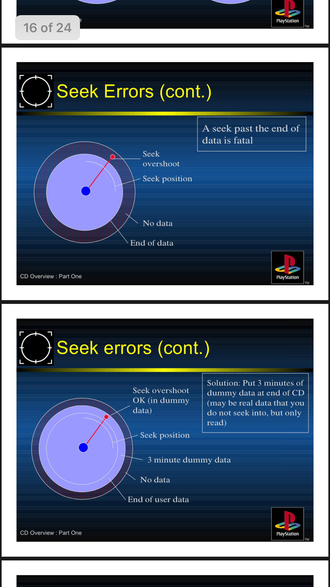

# [alex-free.github.io](https://alex-free.github.io)

# PSX 80 Minute Patcher

_By Alex Free_

Patch PS1 and PS2 CD games to work on early PS2 models when burned to 80 minute/700MB CD-Rs. The earliest PS2 console models (SCPH-10000-SCPH-39004) have a [hardware bug](#ps2-80-minute-cd-r-bug) that causes [some games](#confirmed-80-minute-sensitive-games) to either not boot at all, or crash after while in-game when burned to an 80 minute/700MB CD-R. On PS1 consoles, the same 80 minute/700MB CD-R has no such issues. The only way previously known to work around this hardware bug was to instead burn the affected game to either a 74 minute/650MB or a 71 minute/620MB CD-R. Now for the first time with PSX80MP, you can use 80 miniute/700MB CD-Rs successfully on the affected early PS2 models.

| [Homepage](https://alex-free.github.io/psx80mp) | [Github](https://github.com/alex-free/psx80mp) |

## Table Of Contents

* [Downloads](#downloads)
* [PS2 80 Minute CD-R Bug](#ps2-80-minute-cd-r-bug)
* [Usage](#usage)
* [Confirmed 80 Minute Sensitive Games](#confirmed-80-minute-sensitive-games)
* [License](#license)
* [Building](build.md)

## Downloads

### Version 2.0.1 (8/21/2024)

Changes:

* Fixed a bug that caused some games (i.e. [Street Fighter Alpha 3 (USA)](http://redump.org/disc/508/)) to not work after being patched. Currently there are no known incompatible games that need PSX80MP!

* Implemented my [EzRe](https:/github.com/alex-free/ezre) build system. Deb packages for linux as well as portable zip files for Linux and Windows are available.

* Updated the [Confirmed 80 Minute Sensitive Games](#confirmed-80-minute-sensitive-games) list with more titles.

----------------------------------------------------

*	[psx80mp-v2.0.1-windows-i686-static.zip](https://github.com/alex-free/psx80mp/releases/download/v2.0.1/psx80mp-v2.0.1-windows-i686-static.zip) _Portable Release For Windows 95 OSR 2.5 and above, Pentium CPU minimum (32 bit)_

*	[psx80mp-v2.0.1-windows-x86\_64-static.zip](https://github.com/alex-free/psx80mp/releases/download/v2.0.1/psx80mp-v2.0.1-windows-x86_64-static.zip) _Portable Release For x86_64 Windows (64 bit)_

*	[psx80mp-v2.0.1-linux-i386-static.zip](https://github.com/alex-free/psx80mp/releases/download/v2.0.1/psx80mp-v2.0.1-linux-i386-static.zip) _Portable Release For Linux 3.2.0 and above, 386 CPU minimum (32 bit)_

*	[psx80mp-v2.0.1-linux-i386-static.deb](https://github.com/alex-free/psx80mp/releases/download/v2.0.1/psx80mp-v2.0.1-linux-i386-static.deb) _Deb package file For Linux 3.2.0 and above, 386 CPU minimum (32 bit)_

*	[psx80mp-v2.0.1-linux-x86\_64-static.zip](https://github.com/alex-free/psx80mp/releases/download/v2.0.1/psx80mp-v2.0.1-linux-x86_64-static.zip) _Portable Release For x86\_64 Linux 3.2.0 and above (64 bit)_

*	[psx80mp-v2.0.1-linux-x86\_64-static.deb](https://github.com/alex-free/psx80mp/releases/download/v2.0.1/psx80mp-v2.0.1-linux-x86_64-static.deb) _Deb package file for x86_64 Linux 3.2.0 and above (64 bit)_

----------------------------------------------------

[Previous versions](changelog.md)

## PS2 80 Minute CD-R Bug

First solved in this [tonyhax github issue](https://github.com/socram8888/tonyhax/issues/24), this was a mystery for years. Sony told developers of the original PlayStation in a presentation to make sure you add dummy data to the edge of a disc, because an accidental over-seek into the unburned area of disc will cause a fatal disc read error:

The PS1 was optimized for 71 minute/620MB CD-Rs. 74 minute/650MB and 80 minute/700MB CD-Rs have a tighter spiral winding, which essentially means data is packed more closely in the same physical area. The PS1 CD-ROM drive hardware is always expecting a 71 minute/620MB capacity/data density, so the hard-coded seek table optimization is causing the CD-ROM drive to overseek past where the actual data is for 74 minute/650MB and 80 minute/700MB discs.

Some games developers ignored the Sony docs and did not add dummy data at the end of the disc (because 71 minute/620MB discs in real hardware tests did not present the issue). Other game developers did add dummy data as Sony docs encouraged, but this was only enough dummy data for 71 minute/620MB discs. In practice, real PS1 hardware with any released game reads 80 minute/700MB discs just fine. The early PS2 hardware has some kind of regression however that causes this bug to appear on quite a few officially released games. By adding enough dummy data for an 80 minute/700MB CD-R to games that don't have it already, or adding more dummy data to games that don't have enough for 80 minute/700MB CD-Rs, we can work around this PS2 hardware bug. That's how PSX80MP works. It adds 6 minutes of CDDA silence sectors to the given data track bin file of an affected game CD image.

As some PS2 games were released as CD-ROMs, they may also have this issue (can't remember the link but I noticed some reports of this online at one point in a discussion about PS2 mod-chips).

## Usage

    psx80mp <data track bin file>

    <data track bin file>	This is almost always the first track. If the game still doesn't work, try only patching the second track instead on a clean image.

----------------------------------------------------

You need the BIN/CUE image of the game you want to patch in [redump](http://redump.org) format. Redump format means that each track is a separate file. If your BIN/CUE image contains multiple tracks in one bin file, you must separate them with a tool such as [binmerge](https://github.com/putnam/binmerge). You can use `binmerge -s <binfile>` to split the file into the redump format if needed to use this patcher.

There are 2 ways you can interact with the PSX80MP patcher:

### Drag n' Drop

On Windows and most Linux distributions, you can simply drag the input file on top of the `psx80mp.exe` (Windows releases) or `psx80mp` (linux releases) executable file found in the portable releases.

### Command Line Interface

On Windows execute `psx80mp.exe` with the input file as an argument, i.e. `psx80mp.exe <data track bin file>` using `cmd.exe`, `command.com`  or similar shell. On Linux execute `./psx80mp <data track bin file>` found in the portable release using the Terminal application. Alternatively if you have install the `.deb` package file `psx80mp`  is available as a global user command to the system, so just `psx80mp <data track bin file>` works fine.

Note: The data track bin file you want is usually the first track, but it has been seen with some games (i.e. [Street Fighter Alpha 3 (USA)](http://redump.org/disc/508/)) that you want the second track instead. Only one track needs to be patched (either track 1 or track 2). First try track 1, and if that doesn't work try track 2.

## Confirmed 80 Minute Sensitive Games

These games have been verified to either not boot at all on an affected PS2 console model when burned to 80 minute CD-R. If you have another game you have found that needs PSX80MP, or found a game that isn't working even with PSX80MP, please open a Github [issue](https://github.com/alex-free/psx80mp/issues/new).

| Game Disc  | Track Number To Patch |
| --------------- | ------------- |
| [Biohazard 2 (Japan) (Disc 1) (Leon-hen)](http://redump.org/disc/1525/) | 1 |
| [Biohazard 2 (Japan) (Disc 2) (Claire-hen)](http://redump.org/disc/1526/) | 1 |
| [Final Fantasy IX (Europe) (Disc 1)](http://redump.org/disc/2371/) | 1 |
| [Final Fantasy IX (Europe) (Disc 2)](http://redump.org/disc/2370/) | 1 |
| [Final Fantasy IX (Europe) (Disc 3)](http://redump.org/disc/2370/) | 1 |
| [Final Fantasy IX (Europe) (Disc 4)](http://redump.org/disc/2373/) | 1 |
| [Final Fantasy IX (France) (Disc 1)](http://redump.org/disc/2455/) | 1 |
| [Final Fantasy IX (France) (Disc 2)](http://redump.org/disc/2456/) | 1 |
| [Final Fantasy IX (France) (Disc 3)](http://redump.org/disc/2457/) | 1 |
| [Final Fantasy IX (France) (Disc 4)](http://redump.org/disc/2458/) | 1 |
| [Final Fantasy IX (Germany) (Disc 1)](http://redump.org/disc/737/) | 1 |
| [Final Fantasy IX (Germany) (Disc 2)](http://redump.org/disc/738/) | 1 |
| [Final Fantasy IX (Germany) (Disc 3)](http://redump.org/disc/739/) | 1 |
| [Final Fantasy IX (Germany) (Disc 4)](http://redump.org/disc/740/) | 1 |
| [Final Fantasy IX (Italy) (Disc 1)](http://redump.org/disc/2714/) | 1 |
| [Final Fantasy IX (Italy) (Disc 2)](http://redump.org/disc/2714/) | 1 |
| [Final Fantasy IX (Italy) (Disc 3)](http://redump.org/disc/2714/) | 1 |
| [Final Fantasy IX (Italy) (Disc 4)](http://redump.org/disc/2714/) | 1 |
| [Final Fantasy IX (Japan) (Disc 1)](http://redump.org/disc/73/) | 1 |
| [Final Fantasy IX (Japan) (Disc 2)](http://redump.org/disc/1968/) | 1 |
| [Final Fantasy IX (Japan) (Disc 3)](http://redump.org/disc/1966/) | 1 |
| [Final Fantasy IX (Japan) (Disc 4)](http://redump.org/disc/1965/) | 1 |
| [Final Fantasy IX (USA) (Disc 1)](http://redump.org/disc/73/) | 1 |
| [Final Fantasy IX (USA) (Disc 2)](http://redump.org/disc/74/) | 1 |
| [Final Fantasy IX (USA) (Disc 3)](http://redump.org/disc/75/) | 1 |
| [Final Fantasy IX (USA) (Disc 4)](http://redump.org/disc/5029/) | 1 |
| [I.Q: Intelligent Qube (Japan)](http://redump.org/disc/2267/) | 1 |
| [I.Q: Intelligent Qube (Japan) (Demo)](http://redump.org/disc/68874/) | 1 |
| [I.Q: Intelligent Qube (USA)](http://redump.org/disc/7932/) | 1 |
| [I.Q: Intelligent Qube (USA) (Demo)](http://redump.org/disc/57665/) | 1 |
| [JoJo's Bizarre Adventure (USA)](http://redump.org/disc/386/) | 1 |
| [Kurushi (Europe)](http://redump.org/disc/26776/) | 1 |
| [Mega Man X4 (Europe)](http://redump.org/disc/14657/) | 1 |
| [Mega Man X4 (USA)](http://redump.org/disc/7075/) | 1 |
| [MediEvil (Europe)](http://redump.org/disc/592/) | 1 |
| [MediEvil (France)](http://redump.org/disc/13389/) | 1 |
| [MediEvil (Germany)](http://redump.org/disc/25542/) | 1 |
| [MediEvil (Italy)](http://redump.org/disc/29475/) | 1 |
| [MediEvil (Spain)](http://redump.org/disc/1584/) | 1 |
| [MediEvil: Yomigaetta Gallowmere no Yuusha (Japan)](http://redump.org/disc/33095/) | 1 |
| [Resident Evil 2 (Europe) (Disc 1)](http://redump.org/disc/621/) | 1 |
| [Resident Evil 2 (Europe) (Disc 2)](http://redump.org/disc/1195/) | 1 |
| [Resident Evil 2 (France) (Disc 1)](http://redump.org/disc/10259/) | 1 |
| [Resident Evil 2 (France) (Disc 2)](http://redump.org/disc/10260/) | 1 |
| [Resident Evil 2 (Germany) (Disc 1)](http://redump.org/disc/509/) | 1 |
| [Resident Evil 2 (Germany) (Disc 2)](http://redump.org/disc/464) | 1 |
| [Resident Evil 2 (Italy) (Disc 1)](http://redump.org/disc/2743/) | 1 |
| [Resident Evil 2 (Italy) (Disc 2)](http://redump.org/disc/2742/) | 1 |
| [Resident Evil 2 (Spain) (Disc 1)](http://redump.org/disc/5217/) | 1 |
| [Resident Evil 2 (Spain) (Disc 2)](http://redump.org/disc/2742/) | 1 |
| [Resident Evil: Director's Cut (Europe)](http://redump.org/disc/3382/) | 1 |
| [Resident Evil: Director's Cut (France)](http://redump.org/disc/5825/) | 1 |
| [Resident Evil: Director's Cut (Germany)](http://redump.org/disc/15507/) | 1 |
| [Resident Evil: Director's Cut (USA)](http://redump.org/disc/123/) | 1 |
| [Resident Evil: Director's Cut: Dual Shock Ver. (USA)](http://redump.org/disc/125/) | 1 |
| [Rockman X4 (Japan)](http://redump.org/disc/4777/) | 1 |
| [Rockman X4 (Japan) (Special Box)](http://redump.org/disc/33903/) | 1 |
| [Street Fighter Alpha 3 (USA)](http://redump.org/disc/508/) | 2 |

## License

PSX80MP is released under the 3-BSD license, see the file `license.txt` distributed in the source and releases.